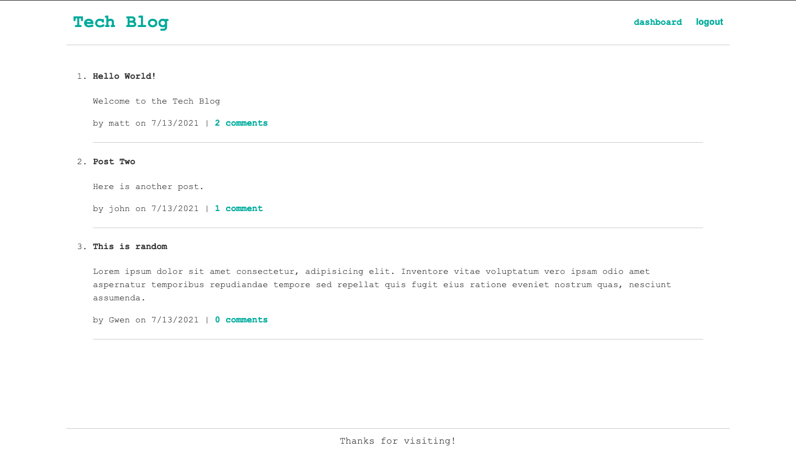

# Tech-Blog

## Description
This app is a blog site for those interested tech. It allows users to make posts as well as see and comment on other users posts. 

## Table of Contents
- [Usage](https://github.com/matty-bennett/tech-blog#usage)
- [Technology](https://github.com/matty-bennett/tech-blog#technology)
- [Screenshot](https://github.com/matty-bennett/tech-blog#screenshot)
- [Questions](https://github.com/matty-bennett/tech-blog#questions)

### Usage
Check out the deployed website [here](https://guarded-everglades-16562.herokuapp.com/).

### Technology
- Express
- Sequelize
- MySQL2
- Node

### Screenshot

### Questions
Contact me with any questions
 
[GitHub](https://github.com/matty-bennett) [Email](mailto:bennyot10@gmail.com)
